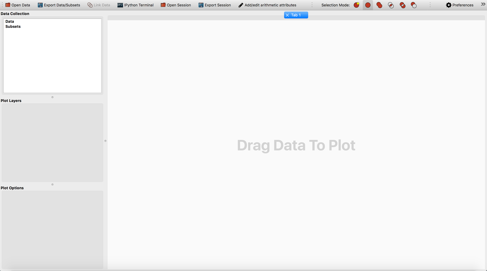
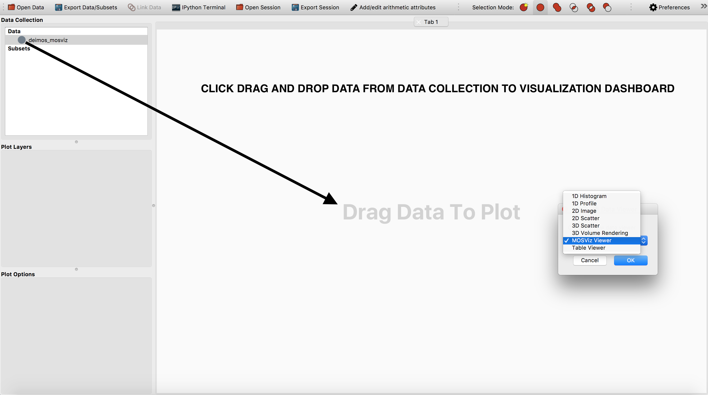
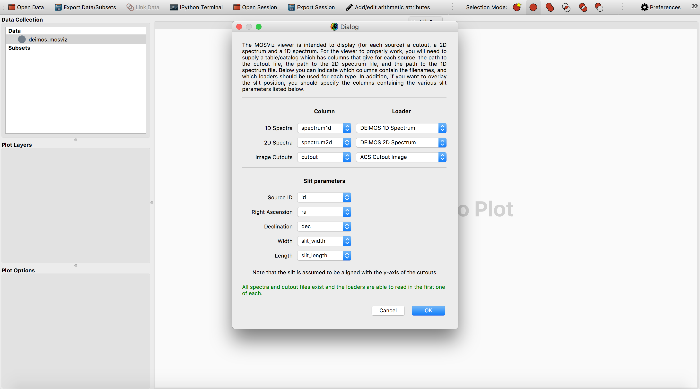
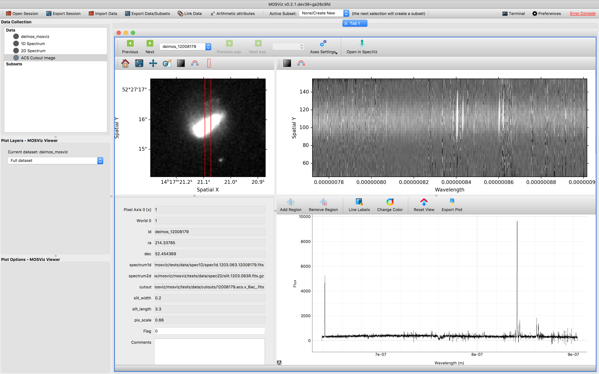

***************************
Getting Started with MOSViz
***************************

This page will walk you through the basics of the MOSViz GUI. The data we will
use for this tutorial is located here:

* :download:`deimos.zip <https://zenodo.org/record/1421377/files/deimos.zip>`

Once you have MOSViz 
`installed <https://mosviz.readthedocs.io/en/latest/installation.html>`_ 
you can launch the GUI by typing:

`$ mosviz`

++++++++++++
Opening Data
++++++++++++

There are many ways to open a dataset with MOSViz:

* By selecting the **Open Data Set** item under the **File** menu or using the equivalent shortcut (e.g. **Ctrl+O** on Linux, **Cmd+O** on Mac).
* Dragging and dropping data files on the main window.
* Through the terminal `$ mosviz deimos_mosviz.tbl`

Find and open `deimos_mosviz.tbl` which should be in the `deimos.zip` file you downloaded above.
We will use
a dataset from the `Deimos <https://www2.keck.hawaii.edu/inst/deimos/>`_ 
instrument at the Keck Observatory. The main components of a MOSViz 
dataset are:

* A catalog of targets in tabular form
* A 2D image cutout
* A 1D spectrum
* A 2D spectrum

.. note::
    MOSViz data tables are in the ECSV (Enhanced Character Separated Values) format. 
    For more detail on ECSV tables go 
    `here <http://docs.astropy.org/en/stable/api/astropy.io.ascii.Ecsv.html>`_.

++++++++++++++++
Visualizing Data
++++++++++++++++

When the dataset is loaded in the data collection, drag and drop the dataset 
from the data collection to the visualization dashboard. A dialog will appear asking you 
to select a data viewer, select the **MOSViz viewer**. 

Next you will be prompted with
another dialog asking you to specify the data readers for each component
of your dataset. This dialog will also contains options to overlay slit positions. For 
this example we are going to use the default settings.

.. note::
   If you open your MOSViz data table via the command line, you will immediately be
   prompted with the diaglog below. You won't have to click drag and
   drop the dataset from the data collection to the visualization dashboard.

Once your configuration is set, click OK. Now the visualization dashboard should contain
a MOSViz viewer with views of all of the different dataset components. 

To view the other spectra and cutouts from the data table, use the Next/Previous buttons
or select by name using the drop down located in the upper left hand corner of the MOSViz Viewer.