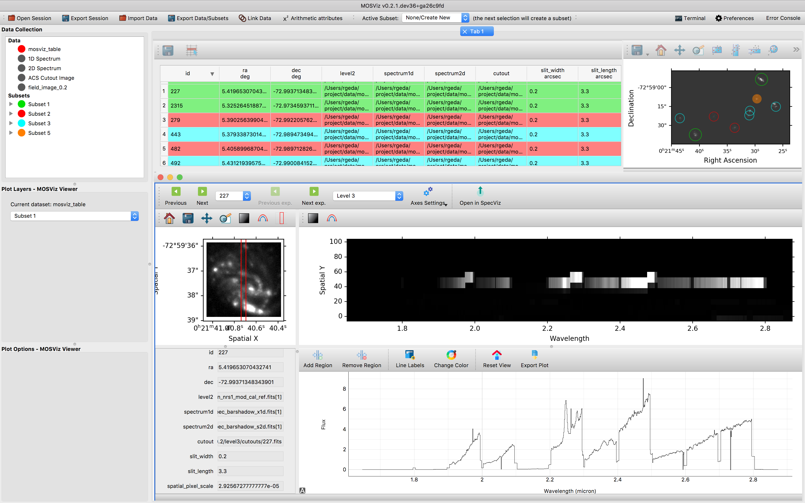

MOSViz: Visualization Tool for Multi-object Spectroscopy
########################################################

MOSViz is a quick-look analysis and visualization tool for multi-object spectroscopy (MOS).  It is designed to work with pipeline output: spectra and associated images, or just with spectra.  MOSViz is created to work with data from any telescope/instrument, but is built with the micro-shutter array (MSA) on the JWST/NIRSpec spectrograph and the JWST/NIRCam imager in mind.  As such, MOSViz has some features specific to NIRSpec and NIRCam data.

The NIRSpec micro-shutter array (MSA) will produce ~100 spectra per pointing.  Many users will perform surveys with the MSA that will result in data sets of thousands to tens of thousands of spectra. Especially in the early days of JWST, careful inspection of all of the data will be critical to achieving scientific goals, and it is important to make this task efficient. Inspection involves looking at the locations of astronomical sources within shutters, the location of background apertures in the observed field, the quality of the 2D spectra, and the quality of the 1D extracted spectra. It also often involves simple interactive measurements of quantities such as wavelengths, velocities, line fluxes, widths.

MOSViz is built using the PyQt programming language that allows for flexible and efficient development of a Graphical User Interface (GUI) using the Python programming language.  MOSViz is incorporated into the Glue visualization tool (Beaumont, Robitaille, & Borkin 2014), and as such, takes advantage of Glue’s “linked views,” as described in Section 4.  It uses the specutils core data object from Astropy (Astropy Collaboration 2013).

.. toctree::
   :maxdepth: 2

   installation
   gettingstarted
   functionality
   readingindata
   api
